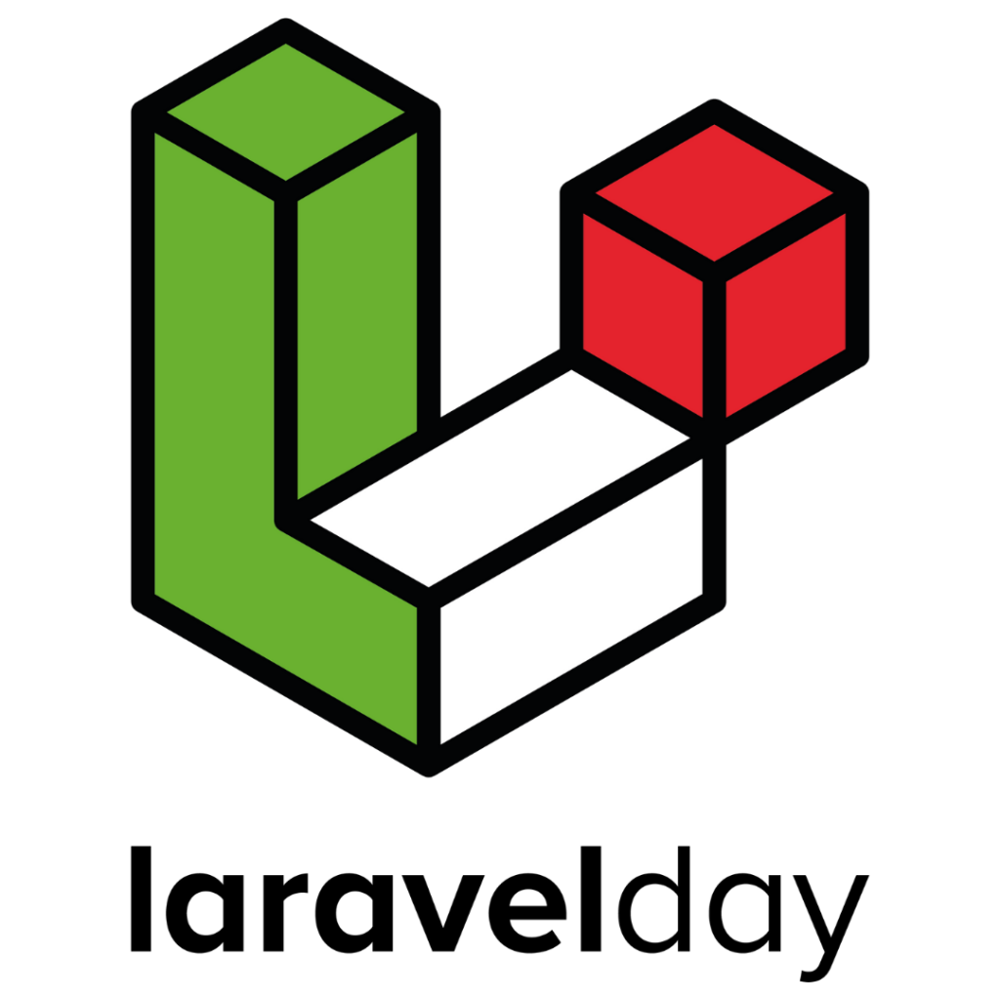

<p align="center"><a href="https://2022.laravelday.it/talks_speakers/" target="_blank"></a></p>

# "User Account Provisioning" in Laravel + SSO con SimpleSAMLphp

Talk presentato al [laravelday](https://2022.laravelday.it/) del 17/11/2022 a Verona.

Autore: Carlo Tafuro

## Introduzione
Obiettivo di questo repository è di illustrare passo passo la realizzazione di un sistema di autenticazione SSO che utilizzi SimpleSAMLphp come IdP (identity provider) e Laravel come backend di dati utente per l'IdP.
L'applicazione Laravel servirà come Dashboard per la gestione dei profili utente (registrazione utente, modifica dati del profilo), interagirà con l'IdP per la convalida delle credenziali di accesso e sarà essa stessa un service provider (SP) per un accesso in SSO.

## Nota

Tutti i file citati nel seguito, che sono stati modificati o aggiunti, sono stati inseriti nella cartella `src` di questo repository.

## Indice
- [1 - Installiamo Laravel Jetstream](#step_1)
- [1.1 - Estendiamo il set di attibuti presenti nel profilo utente](#step_1_1)
- [1.2 - Popoliamo la nostra applicazione con dati fake](#step_1_2)
- [1.3 - Predisponiamo la rotta di tipo api che fornirà i dati del profilo utente al nostro IdP](#step_1_3)
- [2 - Installiamo e configuriamo l'IdP SimpleSAMLphp](#step_2)
- [2.1 - Implementiamo un nuovo modulo di autenticazione](#step_2_1)
- [2.2 - Implementiamo un nuovo modulo del tema grafico](#step_2_2)
- [2.3 - Testiamo l'interazione dell'IdP con l'endpoint Laravel](#step_2_3)
- [3 - Federiamo l'applicazione Laravel in qualità di Service Provider (SP) con l'IdP SimpleSAMLphp](#step_3)
- [3.1 - Sostituiamo i link di login e logout nell'applicazione Laravel con i rispettivi link in SSO](#step_3_1)

### <a name="step_1"></a>1 - Installiamo Laravel Jetstream
[Laravel Jetstream](https://jetstream.laravel.com/) è un ottimo punto di partenza per avviare in pochi minuti un'applicazione Laravel completa di login e registrazione utente.

Per l'applicativo Laravel utilizzeremo un virtual host che risponde all'indirizzo https://laravel.accomodati.it

Installazione via Laravel Installer:

```console
# composer global require laravel/installer
# export PATH="$PATH:$HOME/.composer/vendor/bin"

laravel new --git --jet --stack=livewire --teams home

cd home
```

Configurazioni da inserire nel file **.env**:

```console
MAIL_MAILER=log
MAIL_FROM_ADDRESS="laravel@accomodati.it"

APP_URL=https://laravel.accomodati.it

DB_CONNECTION=mysql
DB_HOST=127.0.0.1
DB_PORT=3306
DB_DATABASE=laravel_db
DB_USERNAME=laravel_usr
DB_PASSWORD=laravel_pwd
```

Configurazioni da inserire nel file **config/app.php**:

```console
'timezone' => 'Europe/Rome'
'locale' => 'it'
'faker_locale' => 'it_IT'
```

Lanciamo ora la migration e la nostra applicazione Laravel sarà attiva e funzionante:

```console
php artisan migrate
```

#### <a name="step_1_1"></a>1.1 - Estendiamo il set di attibuti presenti nel profilo utente

L'applicazione Laravel dovrà contenere i dati di profilo dei nostri utenti sarà quindi utile aggiungere qualche attributo alla tabella **users**:

```console
php artisan make:migration add_extra_field_to_users --table="users"
```

nel nuovo file database/migrations/2022_11_07_194842_add_extra_field_to_users.php

```php
    public function up()
    {
        Schema::table('users', function (Blueprint $table) {

            $table->string('first_name')->after('name')->nullable();
            $table->string('last_name')->after('first_name')->nullable();
            $table->string('city')->after('last_name')->nullable();
            $table->string('country')->after('city')->nullable();
            $table->string('address')->after('country')->nullable();
            $table->string('postcode')->after('address')->nullable();
            $table->string('company')->after('postcode')->nullable();
            $table->string('vat')->after('company')->nullable();
        });
    }

    public function down()
    {
        Schema::table('users', function (Blueprint $table) {
            $table->dropColumn('first_name');
            $table->dropColumn('last_name');
            $table->dropColumn('city');
            $table->dropColumn('country');
            $table->dropColumn('address');
            $table->dropColumn('postcode');
            $table->dropColumn('company');
            $table->dropColumn('vat');
        });
    }
```

nel file **app/Actions/Fortify/UpdateUserProfileInformation.php**

```php
    public function update($user, array $input)
    {
        Validator::make($input, [
            'name' => ['required', 'string', 'max:255'],
            'email' => ['required', 'email', 'max:255', Rule::unique('users')->ignore($user->id)],
            'photo' => ['nullable', 'mimes:jpg,jpeg,png', 'max:1024'],
            'first_name' => ['nullable', 'string', 'max:255'],
            'last_name' => ['nullable', 'string', 'max:255'],
            'city' => ['nullable', 'string', 'max:255'],
            'country' => ['nullable', 'string', 'max:255'],
            'address' => ['nullable', 'string', 'max:255'],
            'postcode' => ['nullable', 'string', 'max:255'],
            'company' => ['nullable', 'string', 'max:255'],
            'vat' => ['nullable', 'string', 'max:255'],
        ])->validateWithBag('updateProfileInformation');

        if (isset($input['photo'])) {
            $user->updateProfilePhoto($input['photo']);
        }

        if ($input['email'] !== $user->email &&
            $user instanceof MustVerifyEmail) {
            $this->updateVerifiedUser($user, $input);
        } else {
            $user->forceFill([
                'name' => $input['name'],
                'email' => $input['email'],
                'first_name' => $input['first_name'],
                'last_name' => $input['last_name'],
                'city' => $input['city'],
                'country' => $input['country'],
                'address' => $input['address'],
                'postcode' => $input['postcode'],
                'company' => $input['company'],
                'vat' => $input['vat'],
            ])->save();
        }
    }
```

nel file **app/Models/User.php**

```php
    protected $fillable = [
        'name', 'email', 'password', 'first_name', 'last_name', 'city', 'country', 'address', 'postcode', 'company', 'vat',
    ];
```

nel file **resources/views/profile/update-profile-information-form.blade.php**

```html
        <!-- first_name -->
        <div class="col-span-6 sm:col-span-4">
            <x-jet-label for="first_name" value="{{ __('Nome') }}" />
            <x-jet-input id="first_name" type="text" class="mt-1 block w-full" wire:model.defer="state.first_name" />
            <x-jet-input-error for="first_name" class="mt-2" />
        </div>

        <!-- last_name -->
        <div class="col-span-6 sm:col-span-4">
            <x-jet-label for="last_name" value="{{ __('Cognome') }}" />
            <x-jet-input id="last_name" type="text" class="mt-1 block w-full" wire:model.defer="state.last_name" />
            <x-jet-input-error for="last_name" class="mt-2" />
        </div>

        <!-- city -->
        <div class="col-span-6 sm:col-span-4">
            <x-jet-label for="city" value="{{ __('Città') }}" />
            <x-jet-input id="city" type="text" class="mt-1 block w-full" wire:model.defer="state.city" />
            <x-jet-input-error for="city" class="mt-2" />
        </div>

        <!-- country -->
        <div class="col-span-6 sm:col-span-4">
            <x-jet-label for="country" value="{{ __('Stato') }}" />
            <x-jet-input id="country" type="text" class="mt-1 block w-full" wire:model.defer="state.country" />
            <x-jet-input-error for="country" class="mt-2" />
        </div>

        <!-- address -->
        <div class="col-span-6 sm:col-span-4">
            <x-jet-label for="address" value="{{ __('Indirizzo') }}" />
            <x-jet-input id="address" type="text" class="mt-1 block w-full" wire:model.defer="state.address" />
            <x-jet-input-error for="address" class="mt-2" />
        </div>

        <!-- postcode -->
        <div class="col-span-6 sm:col-span-4">
            <x-jet-label for="postcode" value="{{ __('CAP') }}" />
            <x-jet-input id="postcode" type="text" class="mt-1 block w-full" wire:model.defer="state.postcode" />
            <x-jet-input-error for="postcode" class="mt-2" />
        </div>

        <!-- company -->
        <div class="col-span-6 sm:col-span-4">
            <x-jet-label for="company" value="{{ __('Azienda') }}" />
            <x-jet-input id="company" type="text" class="mt-1 block w-full" wire:model.defer="state.company" />
            <x-jet-input-error for="company" class="mt-2" />
        </div>

        <!-- vat -->
        <div class="col-span-6 sm:col-span-4">
            <x-jet-label for="vat" value="{{ __('P. IVA') }}" />
            <x-jet-input id="vat" type="text" class="mt-1 block w-full" wire:model.defer="state.vat" />
            <x-jet-input-error for="vat" class="mt-2" />
        </div>
```

#### <a name="step_1_2"></a>1.2 - Popoliamo la nostra applicazione con dati fake

nel file **database/factories/UserFactory.php**

```php
    public function definition()
    {

        //
        // https://fakerphp.github.io/formatters/
        // https://fakerphp.github.io/locales/it_IT/
        //
        $first_name = $this->faker->firstName();
        $last_name = $this->faker->lastName();
        //$email = $this->faker->unique()->safeEmail();
        $email = preg_replace('/[^A-Za-z0-9\-\.]/', '', Str::lower(Str::ascii($first_name . '.' . $last_name))) . '@accomodati.it';

        return [
            'name' => $first_name . ' ' . $last_name,
            'first_name' => $first_name,
            'last_name' => $last_name,
            'city' => $this->faker->state(),
            'country' => 'Italia',
            'address' => $this->faker->streetAddress(),
            'postcode' => $this->faker->postcode(),
            'company' => $this->faker->company(),
            'vat' => $this->faker->vat(),
            'email' => $email,
            'email_verified_at' => now(),
            'password' => \Hash::make('demopassword'),
            'remember_token' => Str::random(10),
        ];
    }
```

e nel file database/seeders/DatabaseSeeder.php

```php
    public function run()
    {
        \App\Models\User::factory(10)->withPersonalTeam()->create();
    }
```

Lanciamo nuovamente la migration:

```console
php artisan migrate:fresh --seed
```


| id | name             | first_name | last_name | city              | country | address                         | postcode | company                              | vat           | email                          | email_verified_at   | password   | two_factor_secret | two_factor_recovery_codes | two_factor_confirmed_at | remember_token | current_team_id | profile_photo_path | created_at          | updated_at          |
|----|------------------|------------|-----------|-------------------|---------|---------------------------------|----------|--------------------------------------|---------------|--------------------------------|---------------------|------------|-------------------|---------------------------|-------------------------|----------------|-----------------|--------------------|---------------------|---------------------|
|  1 | Cleros Lombardo  | Cleros     | Lombardo  | Macerata          | Italia  | Borgo Harry 959 Appartamento 23 | 95469    | Sartori, Gentile e Bianchi s.r.l.    | IT97526580739 | cleros.lombardo@accomodati.it  | 2022-11-08 07:12:48 | $2y$10$... | NULL              | NULL                      | NULL                    | QIdZdmFTQc     |            NULL | NULL               | 2022-11-08 07:12:48 | 2022-11-08 07:12:48 |
|  2 | Italo Sartori    | Italo      | Sartori   | Agrigento         | Italia  | Via Costa 97                    | 82590    | Grassi e figli                       | IT35366970974 | italo.sartori@accomodati.it    | 2022-11-08 07:12:48 | $2y$10$... | NULL              | NULL                      | NULL                    | awuLBx0HQS     |            NULL | NULL               | 2022-11-08 07:12:49 | 2022-11-08 07:12:49 |
|  3 | Luna D'amico     | Luna       | D'amico   | Verona            | Italia  | Incrocio Ferrari 5 Piano 4      | 93895    | Bernardi, Carbone e Longo Group      | IT37728141104 | luna.damico@accomodati.it      | 2022-11-08 07:12:48 | $2y$10$... | NULL              | NULL                      | NULL                    | nxct4mtPVL     |            NULL | NULL               | 2022-11-08 07:12:49 | 2022-11-08 07:12:49 |
|  4 | Luce Moretti     | Luce       | Moretti   | Bari              | Italia  | Piazza Ninfa 70 Appartamento 84 | 30006    | Riva, Villa e Mariani Group          | IT30952130919 | luce.moretti@accomodati.it     | 2022-11-08 07:12:48 | $2y$10$... | NULL              | NULL                      | NULL                    | aDHg8BoJ4u     |            NULL | NULL               | 2022-11-08 07:12:49 | 2022-11-08 07:12:49 |
|  5 | Osvaldo Giordano | Osvaldo    | Giordano  | Chieti            | Italia  | Piazza Cattaneo 55              | 87954    | Damico, Rinaldi e Parisi SPA         | IT40660490281 | osvaldo.giordano@accomodati.it | 2022-11-08 07:12:48 | $2y$10$... | NULL              | NULL                      | NULL                    | qEEV5ZaJ7d     |            NULL | NULL               | 2022-11-08 07:12:49 | 2022-11-08 07:12:49 |
|  6 | Sibilla Bernardi | Sibilla    | Bernardi  | Gorizia           | Italia  | Incrocio Armando 37             | 95112    | Esposito-Gatti e figli               | IT62138170733 | sibilla.bernardi@accomodati.it | 2022-11-08 07:12:48 | $2y$10$... | NULL              | NULL                      | NULL                    | 3qgRDGDRpU     |            NULL | NULL               | 2022-11-08 07:12:49 | 2022-11-08 07:12:49 |
|  7 | Zaccaria Bianchi | Zaccaria   | Bianchi   | Pordenone         | Italia  | Rotonda Marino 636              | 65448    | Pellegrini, Vitale e Rinaldi e figli | IT29753240992 | zaccaria.bianchi@accomodati.it | 2022-11-08 07:12:48 | $2y$10$... | NULL              | NULL                      | NULL                    | 926MnyOPTa     |            NULL | NULL               | 2022-11-08 07:12:49 | 2022-11-08 07:12:49 |
|  8 | Dante Carbone    | Dante      | Carbone   | Ravenna           | Italia  | Via Bruno 63 Appartamento 48    | 65010    | Rossi-Bianco s.r.l.                  | IT55940100989 | dante.carbone@accomodati.it    | 2022-11-08 07:12:48 | $2y$10$... | NULL              | NULL                      | NULL                    | IByxfiXjwU     |            NULL | NULL               | 2022-11-08 07:12:49 | 2022-11-08 07:12:49 |
|  9 | Osvaldo Romano   | Osvaldo    | Romano    | Taranto           | Italia  | Via Villa 6 Piano 1             | 38065    | Ferrara, Rossi e De Santis Group     | IT21965300821 | osvaldo.romano@accomodati.it   | 2022-11-08 07:12:48 | $2y$10$... | NULL              | NULL                      | NULL                    | E2xskurx1x     |            NULL | NULL               | 2022-11-08 07:12:49 | 2022-11-08 07:12:49 |
| 10 | Ruth Carbone     | Ruth       | Carbone   | Carbonia-Iglesias | Italia  | Borgo Gaetano 515               | 38555    | Basile-Esposito Group                | IT76670371004 | ruth.carbone@accomodati.it     | 2022-11-08 07:12:48 | $2y$10$... | NULL              | NULL                      | NULL                    | tbafZipZZz     |            NULL | NULL               | 2022-11-08 07:12:49 | 2022-11-08 07:12:49 |

#### <a name="step_1_3"></a>1.3 - Predisponiamo la rotta di tipo api che fornirà i dati del profilo utente al nostro IdP

La nuova rotta api risponderà con un payload contenente tutti i dati di un singolo utente, LA **PROTEZIONE DELLA ROTTA** è quindi un punto fondamentale su cui porre molta attenzione.

La **prima forma di protezione** che utilizzeremo è un'autenticazione di tipo Basic (Basic HTTP authentication) nelle richieste:

Torniamo sul nostro terminale è produciamo un nuovo middleware:

```console
php artisan make:middleware UserProfileAPIMiddleware
```

nel nuovo file app/Http/Middleware/UserProfileAPIMiddleware.php

```php
    namespace App\Http\Middleware;

    use Closure;
    use Illuminate\Http\Request;

    class UserProfileAPIMiddleware
    {
        /**
        * Handle an incoming request.
        *
        * @param  \Illuminate\Http\Request  $request
        * @param  \Closure(\Illuminate\Http\Request): (\Illuminate\Http\Response|\Illuminate\Http\RedirectResponse)  $next
        * @return \Illuminate\Http\Response|\Illuminate\Http\RedirectResponse
        */
        public function handle(Request $request, Closure $next)
        {
            $basic_authorization = 'Basic ' . base64_encode('remote_api_user:123456789');

            if ($request->hasHeader('authorization') and $request->header('authorization') == $basic_authorization) {
                return $next($request);
            } else {
                return response()->json(['result' => false, 'error' => 'api auth error']);
            }
        }
    }
```
La **seconda forma di protezione** che utilizzeremo è sul numero massimo di richieste per unità di tempo.
È fondamentale osservare che Laravel implementa nativamente un "**rate limiter**" per le rotte di tipo api.

Nel file [app/Http/Kernel.php](https://github.com/laravel/laravel/blob/9.x/app/Http/Kernel.php#L43) viene dichiarato per tutte le rotte api il middleware: '**throttle:api**'.

```php
    protected $middlewareGroups = [
        ...
        'api' => [
            ...
            'throttle:api',
        ],
    ];
```

Il rate limiter: 'throttle:api' è poi definito in [app/Providers/RouteServiceProvider.php](https://github.com/laravel/laravel/blob/9.x/app/Providers/RouteServiceProvider.php#L46)

```php
    protected function configureRateLimiting()
    {
        RateLimiter::for('api', function (Request $request) {
            return Limit::perMinute(60)->by($request->user()?->id ?: $request->ip());
        });
    }
```
Il middleware impone un massimo di 60 richieste al minuto assegnate all'utente, nel caso in cui la richiesta parta da una sessione autenticata, altrimenti assegnate all'IP di provenienza.

Nel nostro caso la rotta contenente i dati di un singolo utente sarà **invocata esclusivamente dal nostro IdP** che si troverà  nel mezzo tra l'applicazione Laravel e il browser dell'utente che tenta di autenticarsi, quindi le richieste arriveranno sempre e solo dall'indirizzo IP del IdP e non saranno mai inserite in una sessione autenticata.

È chiaro quindi che 60 richieste al minuto sono veramente poche, si pensi ad esempio al caso di un ecommerce che invia una newsletter promozionale e porta contemporaneamente molti utenti sul suo sito che tenteranno di accedere.

Vediamo quindi come modificare il rate limiter adattandolo alle nostre necessità.

Torniamo sul nostro terminale è produciamo un nuovo service provider:

```console
php artisan make:provider UserProfileAPIServiceProvider
```

nel nuovo file app/Providers/UserProfileAPIServiceProvider.php

```php
    namespace App\Providers;

    use Illuminate\Support\ServiceProvider;

    use Illuminate\Http\Request;
    use Illuminate\Cache\RateLimiting\Limit;
    use Illuminate\Support\Facades\RateLimiter;

    class UserProfileAPIServiceProvider extends ServiceProvider
    {
        /**
        * Register services.
        *
        * @return void
        */
        public function register()
        {
            //
        }

        /**
        * Bootstrap services.
        *
        * @return void
        */
        public function boot()
        {
            RateLimiter::for('user_profile_rate', function (Request $request) {

                info('request username: ', ['username' => $request->input('username')]);

                if ( $request->input('username') !== null and trim($request->input('username')) != '' ) {

                    $rate_per_minute = 5;
                    $rate_by = $request->input('username');

                } else {

                    $rate_per_minute = 60;
                    $rate_by = optional($request->user())->id ?: $request->ip();
                }

                return Limit::perMinute($rate_per_minute)
                ->by($rate_by)
                ->response(function (Request $request, array $headers) {
                    return response(
                        json_encode([
                            'result' => false,
                            'error' => 'too many login attempts', // 'Too many login attempts. Please try again in :seconds seconds.'
                            'retry_after' => $headers['Retry-After'],
                            'user_data' => (object) []
                        ]),
                        429,
                        $headers
                    );
                });
            });
        }
    }
```
Il nostro rate limiter analizzerà il payload, limitando le richieste sulla base dello username fornito.
Per prevenire attacchi di forza bruta finalizzati a scoprire la password di un utente limiteremo le richieste a massimo 5 per minuto per uno stesso username.

Registriamo il nuovo provider nella lista dei provider da caricare nel file **config/app.php**

```php
    'providers' => [
        ...

        /*
         * User Profile API Service Provider
         */
        App\Providers\UserProfileAPIServiceProvider::class,
    ],
```

possiamo ora definire la nostra nuova rotta:

nel file **routes/api.php**

```php
use App\Http\Controllers\UserProfileAPIController;
use App\Http\Middleware\UserProfileAPIMiddleware;

//
// NOTA IMPORTANTE: Se non rimuovo il rate limiter predefinito 'throttle:api'
// per lasciare soltanto il rate limiter 'throttle:user_profile_rate'
// verranno applicati entrambi e tra i due prevarrà quello più restrittivo.
//
//

//
// ALTERNATIVE DI TEST
//
// CON RATE LIMITER DI DEFAULT: 'throttle:api'
// Route::middleware([UserProfileAPIMiddleware::class])->group(function ()
//
// SENZA RATE LIMITER: 'throttle:api'
// Route::middleware([UserProfileAPIMiddleware::class])->withoutMiddleware(['throttle:api'])->group(function ()
//
// CON RATE LIMITER: 'throttle:user_profile_rate' E SENZA RATE LIMITER: 'throttle:api'
Route::middleware([UserProfileAPIMiddleware::class, 'throttle:user_profile_rate'])->withoutMiddleware(['throttle:api'])->group(function ()
{
    Route::post('/user_profile', [UserProfileAPIController::class, 'ProfileProvisioning']);
});
```

Importante osservare come il Middleware 'throttle:api' sia stato eliminato.

Possiamo ora effettuare una prima chiamata di test della nostra nuova rotta, da terminale:

```console
curl 'https://laravel.accomodati.it/api/user_profile' \
--silent \
--request POST \
--user 'remote_api_user:123456789' \
--header 'Content-Type: application/json' \
--header 'Accept: application/json' \
--data-raw '{"username":"sibilla.bernardi@accomodati.it","password":"demopassword"}'
```
che produce in risposta:

```json
{
  "result": true,
  "error": "",
  "user_data": {
    "id": 11,
    "name": "Sibilla Bernardi",
    "first_name": "Sibilla",
    "last_name": "Bernardi",
    "city": "Gorizia",
    "country": "Italia",
    "address": "Incrocio Armando 37",
    "postcode": "95112",
    "company": "Esposito-Gatti e figli",
    "vat": "IT62138170733",
    "email": "sibilla.bernardi@accomodati.it",
    "email_verified_at": null,
    "two_factor_confirmed_at": null,
    "current_team_id": 11,
    "profile_photo_path": null,
    "created_at": "2022-11-08T07:12:49.000000Z",
    "updated_at": "2022-11-08T07:12:49.000000Z",
    "profile_photo_url": "https://ui-avatars.com/api/?name=S+B&color=7F9CF5&background=EBF4FF"
  }
}
```

lo script test-rate-limiting.php viene fornito per effettuare test di invocazione ripetuta sulla nuova rotta.

### <a name="step_2"></a>2 - Installiamo e configuriamo l'IdP SimpleSAMLphp

[SimpleSAMLphp](https://simplesamlphp.org/) è un'applicazione PHP il cui obiettivo primario è fornire supporto completo al **protocollo SAML** (Security Assertion Markup Language) implementando entrambe le componenti:

* SAML 2.0 come **Service Provider (SP)**
* SAML 2.0 come **Identity Provider (IdP)**

Per l'applicativo SimpleSAMLphp utilizzeremo un virtual host che risponde all'indirizzo https://idp.accomodati.it

Nel momento in cui scrivo l'ultimo rilascio stabile è il 1.19.6

```console
curl -OL https://github.com/simplesamlphp/simplesamlphp/releases/download/v1.19.6/simplesamlphp-1.19.6.tar.gz

shasum -a 256 simplesamlphp-1.19.6.tar.gz | grep --color 834bb4a89d63d7498e77cceb49e01b919d1c0a6a3d38a992f905810dad424b7c

tar -xzf simplesamlphp-1.19.6.tar.gz

mv simplesamlphp-1.19.6 home

cd home
```

Generiamo una chiave segreta che inseriremo poi come valore di **secretsalt** in config/config.php

```console
	tr -c -d '0123456789abcdefghijklmnopqrstuvwxyz' < /dev/urandom | dd bs=32 count=1 2>/dev/null ; echo

	ox48mfxn8o8zgfu74g69hap9wassys2t
```

Generiamo la password che inseriremo poi come valore di **auth.adminpassword** in config/config.php

```console
	php bin/pwgen.php

	Enter password: demopassword

		$2y$10$AuQ30VXnxQyKVLjipFZnt.O2NDxmdAikHRdssTgOCmbii6gxYhcYe
```

Generiamo il **certificato self-signed** utilizzato poi in metadata/saml20-idp-hosted.php

```console
cd cert/

openssl req -new -x509 -days 3650 -newkey rsa:2048 -nodes -keyout server.pem -out server.crt -subj "/C=IT/ST=Italy/L=Verona (LE)/O=IdP Accomodati/OU=SSO/CN=idp.accomodati.it/emailAddress=tech@accomodati.it"

openssl x509 -in server.crt -noout -text

cd ..
```

I due nuovi file generati sono referenziati dal file metadata/saml20-idp-hosted.php:

```php
$metadata['__DYNAMIC:1__'] = [
    ...
    // X.509 key and certificate. Relative to the cert directory.
    'privatekey' => 'server.pem',
    'certificate' => 'server.crt',
    ...

];
```
Passiamo ora a modificare il file di configurazione principale config/config.php

```diff
+     'baseurlpath' => '/',
-     'baseurlpath' => 'simplesaml/',

+     'technicalcontact_email' => 'idp@accomodati.it',
-     'technicalcontact_email' => 'na@example.org',

+     'timezone' => 'Europe/Rome',
-     'timezone' => null,

+     'secretsalt' => 'ox48mfxn8o8zgfu74g69hap9wassys2t',
-     'secretsalt' => 'defaultsecretsalt',

+     'auth.adminpassword' => '$2y$10$AuQ30VXnxQyKVLjipFZnt.O2NDxmdAikHRdssTgOCmbii6gxYhcYe',
-     'auth.adminpassword' => '123',

+     'admin.protectindexpage' => true,
-     'admin.protectindexpage' => false,

+     'showerrors' => false,
+     'errorreporting' => false,
-     'showerrors' => true,
-     'errorreporting' => true,

+     'logging.level' => SimpleSAML\Logger::WARNING,
+     'logging.handler' => 'file',
-     'logging.level' => SimpleSAML\Logger::NOTICE,
-     'logging.handler' => 'syslog',

+     'database.dsn' => 'mysql:host=localhost;dbname=idp_db',
-     'database.dsn' => 'mysql:host=localhost;dbname=saml',

+     'database.username' => 'idp_usr',
+     'database.password' => 'idp_pwd',
-     'database.username' => 'simplesamlphp',
-     'database.password' => 'secret',

+     'enable.saml20-idp' => true,
-     'enable.saml20-idp' => false,

+     'language.available___' => [
-     'language.available' => [

+     'language.available' => ['it', 'en'],

+     'language.default' => 'it',
-     'language.default' => 'en',

+     'theme.use' => 'demoTheme:logintheme',
-     'theme.use' => 'default',

+     'store.type'                    => 'sql',
-     'store.type'                    => 'phpsession',

+     'store.sql.dsn'                 => 'mysql:host=localhost;dbname=idp_db',
-     'store.sql.dsn'                 => 'sqlite:/path/to/sqlitedatabase.sq3',

+     'store.sql.username' => 'idp_usr',
+     'store.sql.password' => 'idp_pwd',
-     'store.sql.username' => null,
-     'store.sql.password' => null,
```

Nel file **config/authsources.php** sono definite a titolo di esempio diverse fonti di autenticazione, una lettura attenta è molto utile.
Procedo eliminando tutte le fonti di autenticazione, aggiungerò dopo le nuove fonti di autenticazione che andrò a definire.
Al momento resta solo la fonte di autenticazione 'admin' (authentication source which handles admin authentication)

```php
$config = [

    // This is a authentication source which handles admin authentication.
    'admin' => [
        // The default is to use core:AdminPassword, but it can be replaced with
        // any authentication source.
        'core:AdminPassword',
    ],
];
```

Le fonti di autenticazione definite in questo file, per essere usate come fonti di autenticazione IdP, dovranno poi essere attivate in metadata/saml20-idp-hosted.php

Elimino tutto il contenuto della cartella metadata/, il suo contenuto è identico a quello di metadata-templates/ da cui recupero solo il file:
saml20-idp-hosted.php

```console
rm metadata/*
cp metadata-templates/saml20-idp-hosted.php metadata/saml20-idp-hosted.php
```

Nel file **metadata/saml20-idp-hosted.php** commento la fonte di autenticazione 'example-userpass'

```diff
$metadata['__DYNAMIC:1__'] = [
    ...

    /*
     * Authentication source to use. Must be one that is configured in
     * 'config/authsources.php'.
     */
-    'auth' => 'laravel-auth',
+    //'auth' => 'example-userpass',
    ...
];
```

da terminale predispongo le cartelle dove saranno posizionati i file di configurazione dei siti federati nel sistema di SSO:

```console
mkdir -p metadata/saml20-sp-remote/{enabled,disabled}/
```

nuovo file metadata/saml20-sp-remote.php

```php
<?php

/**
 * SAML 2.0 remote SP metadata for SimpleSAMLphp.
 *
 * See: https://simplesamlphp.org/docs/1.19/simplesamlphp-reference-sp-remote
 */


$enabled_sp_remote_dir = __DIR__ . '/saml20-sp-remote/enabled/';

$enabled_sp_remote_array = scandir($enabled_sp_remote_dir, SCANDIR_SORT_ASCENDING);

foreach($enabled_sp_remote_array as $enabled_sp_remote_file) {

	if ( substr($enabled_sp_remote_file, -4) == '.php') { // escludo le voci '.' e '..'

		require_once($enabled_sp_remote_dir . $enabled_sp_remote_file);
	}
}
```

#### <a name="step_2_1"></a>2.1 - Implementiamo un nuovo modulo di autenticazione

Occorre ora produrre un **nuovo modulo** che implementa una nuova fonte di autenticazione il cui compito è interagire con l'endpoint esposto da Laravel, il nome utilizzato è **laravelAuth**.

Tra i moduli nativi di SimpleSAMLphp un ottimo riferimento per la scrittura del nostro nuovo modulo è il modulo `/modules/sqlauth` la cui logica è tutta contenuta nel file `/modules/sqlauth/lib/Auth/Source/SQL.php`

Da terminale:

```console
mkdir -p modules/laravelAuth/lib/Auth/Source/
```

Tutta la logica del nostro modulo è contenuta nel file `modules/laravelAuth/lib/Auth/Source/Remote.php`, fare riferimento al codice inserito in questo repository.

La nuova fonte di autenticazione deve ora essere configurata nel file **config/authsources.php**:

```php
$config = [
    ...

    'laravel-auth' => [
        'laravelAuth:Remote',
        'endpoit_url' => 'https://laravel.accomodati.it/api/user_profile',
        'basic_auth_username' => 'remote_api_user',
        'basic_auth_password' => '123456789',
    ],
];
```

e deve essere attivata nel file **metadata/saml20-idp-hosted.php**

```php
$metadata['__DYNAMIC:1__'] = [
    ...

    /*
     * Authentication source to use. Must be one that is configured in
     * 'config/authsources.php'.
     */
    'auth' => 'laravel-auth',
];
```

infine per abilitare il nuovo modulo, da terminale:

```console
touch modules/laravelAuth/default-enable
```

Per uleriori approfondimenti fare riferimento alla pagina di documentazione: https://simplesamlphp.org/docs/1.19/simplesamlphp-customauth.html

#### <a name="step_2_2"></a>2.2 - Implementiamo un nuovo modulo del tema grafico

Occorre ora produrre un **nuovo modulo** che implementa una nuova interfaccia di autenticazione, il nome utilizzato è **demoTheme**.
La via più semplice da seguire è quella di copiare i file del tema originale e procedere poi alla modifica.

Il nuovo tema esporrà un'interfaccia di autenticazione il più possibile simile a quella nativa di Laravel Jetstream.

Da terminale:

```console
mkdir -p modules/demoTheme/themes/logintheme/default/includes/
mkdir -p modules/demoTheme/themes/logintheme/core/
mkdir -p modules/demoTheme/www/resources

cp templates/includes/header.php                modules/demoTheme/themes/logintheme/default/includes/header_custom.php
cp templates/includes/footer.php                modules/demoTheme/themes/logintheme/default/includes/footer_custom.php
cp modules/core/templates/loginuserpass.tpl.php modules/demoTheme/themes/logintheme/core/loginuserpass.tpl.php

touch modules/demoTheme/default-enable
```

Per il codice sorgente fare riferimento ai file pubblicati in questo repository.

Per uleriori approfondimenti fare riferimento alla pagina di documentazione: https://simplesamlphp.org/docs/1.19/simplesamlphp-theming

Il nuovo tema deve ora essere inserito nel file di configurazione **config/config.php**

```php
$config = [

    ...
    /**************
     | APPEARANCE |
     **************/

    /*
     * Which theme directory should be used?
     */
    'theme.use' => 'demoTheme:logintheme',
];
```

#### <a name="step_2_3"></a>2.3 - Testiamo l'interazione dell'IdP con l'endpoint Laravel

SimpleSAMLphp è ora installato e configurato, per verificare il corretto funzionamento provare ad effettuare una prima autenticazione dall'indirizzo: https://idp.accomodati.it/module.php/core/authenticate.php?as=laravel-auth

### <a name="step_3"></a>3 - Federiamo l'applicazione Laravel in qualità di Service Provider (SP) con l'IdP SimpleSAMLphp

In accordo con il protocollo SAML, l’accesso al servizio di autenticazione fornito da SimpleSAMLphp, in qualità di IdP, è consentito tramite un meccanismo preliminare di federazione che consiste nello scambio di metadata che descrivono in un modo standardizzato gli attori coinvolti.

Il primo passo da fare è posizionarci nuovamente nella cartella home della nostra applicazione Laravel e installare un nuovo package che implementi il protocollo SAML 2.0 e permetta l'integrazione di Laravel come Service Provider (SP).

Il package impiegato in questo esempio è `aacotroneo/laravel-saml2`, è sicuramente il package più noto ed utilizzato per il nostro scopo anche se di recente il progetto ha smesso di ricevere supporto dal suo autore. Un'alternativa valida potrebbe essere il package `24slides/laravel-saml2`.

- https://github.com/aacotroneo/laravel-saml2
- https://github.com/24Slides/laravel-saml2

Posizioniamoci quindi nella cartella home della nostra applicazione Laravel e da terminale:

```console
composer require aacotroneo/laravel-saml2
```

Registriamo il nuovo provider nella lista dei provider da caricare nel file **config/app.php**

```php
    'providers' => [
        ...

        /*
         * Single Sign On SAML2 Service Providers...
         */
        Aacotroneo\Saml2\Saml2ServiceProvider::class,
    ],
```

Procediamo con la pubblicazione di tutti gli asset del nuovo package:

```php
php artisan vendor:publish --provider="Aacotroneo\Saml2\Saml2ServiceProvider"

    INFO  Publishing assets.

    Copying file [vendor/aacotroneo/laravel-saml2/src/config/saml2_settings.php] to [config/saml2_settings.php] ....... DONE
    Copying file [vendor/aacotroneo/laravel-saml2/src/config/test_idp_settings.php] to [config/saml2/test_idp_settings.php]  DONE
```

Procediamo modificando opportunamente la configurazione del nuovo file **config/saml2_settings.php**

```diff
+     'idpNames' => ['laravelsso'],
-     'idpNames' => ['test'],


+      *    Method | URI                                | Name             |
+      *    -------|------------------------------------|------------------|---------------------------------------------------
+      *    POST   | {routesPrefix}/{idpName}/acs       | saml2_acs         | https://laravel.accomodati.it/saml2/laravelsso/acs
+      *    GET    | {routesPrefix}/{idpName}/login     | saml2_login       | https://laravel.accomodati.it/saml2/laravelsso/login
+      *    GET    | {routesPrefix}/{idpName}/logout    | saml2_logout      | https://laravel.accomodati.it/saml2/laravelsso/logout
+      *    GET    | {routesPrefix}/{idpName}/metadata  | saml2_metadata    | https://laravel.accomodati.it/saml2/laravelsso/metadata
+      *    GET    | {routesPrefix}/{idpName}/sls       | saml2_sls         | https://laravel.accomodati.it/saml2/laravelsso/sls
-      *    Method | URI                                | Name
-      *    -------|------------------------------------|------------------
-      *    POST   | {routesPrefix}/{idpName}/acs       | saml_acs
-      *    GET    | {routesPrefix}/{idpName}/login     | saml_login
-      *    GET    | {routesPrefix}/{idpName}/logout    | saml_logout
-      *    GET    | {routesPrefix}/{idpName}/metadata  | saml_metadata
-      *    GET    | {routesPrefix}/{idpName}/sls       | saml_sls

+     'routesMiddleware'             => ['saml'],
-     'routesMiddleware' => [],

+     'loginRoute'                   => '/dashboard',
-     'loginRoute' => '/',
```

Il valore `laravelsso` assegnato alla variabile `idpNames` definisce il file di configurazione dell'IdP che sarà caricato.

Copiamo il file di configurazione di esempio fornito:

```diff
cp config/saml2/test_idp_settings.php config/saml2/laravelsso_idp_settings.php
```

e procediamo modificando opportunamente la configurazione del nuovo file **config/saml2/laravelsso_idp_settings.php**

*nota:* in questo file dovremo inserire il certificato utilizzato da l'IdP per cifrare i messaggi scambiati, la stringa X509 può essere prelevata al link: https://idp.accomodati.it/saml2/idp/metadata.php?output=xhtml (vedi X509Certificate) o al link: https://idp.accomodati.it/module.php/saml/idp/certs.php/idp.crt
Il concetto di `federazione` si esplicita proprio nello scambio reciproco di metadata.

```diff
+ $this_idp_env_id = 'LARAVELSSO';
- $this_idp_env_id = 'TEST';

+ $idp_host = env('SAML2_'.$this_idp_env_id.'_IDP_HOST', 'https://idp.accomodati.it');
- $idp_host = env('SAML2_'.$this_idp_env_id.'_IDP_HOST', 'http://localhost:8000/simplesaml');


+         'entityId' => env('SAML2_'.$this_idp_env_id.'_SP_ENTITYID','laravel-accomodati-it-sp'),
-         'entityId' => env('SAML2_'.$this_idp_env_id.'_SP_ENTITYID',''),


+         'x509cert' => env('SAML2_'.$this_idp_env_id.'_IDP_x509', 'MIIEGTCC...'),
-         'x509cert' => env('SAML2_'.$this_idp_env_id.'_IDP_x509', 'MIID/TCC...'),


+             'givenName' => 'Laravel Jetstream',
+             'emailAddress' => 'laravel@accomodati.it'
-             'givenName' => 'name',
-             'emailAddress' => 'no@reply.com'


+             'givenName' => 'Laravel Jetstream',
+             'emailAddress' => 'laravel@accomodati.it'
-             'givenName' => 'Support',
-             'emailAddress' => 'no@reply.com'


+    'organization' => array(
+        'en-US' => array(
+            'name' => 'Laravel Jetstream',
+            'displayname' => 'Laravel Jetstream',
+            'url' => 'https://laravel.accomodati.it/'
+        ),
+        'it-IT' => array(
+            'name' => 'Laravel Jetstream',
+            'displayname' => 'Laravel Jetstream',
+            'url' => 'https://laravel.accomodati.it/'
+        ),
+    ),
-    'organization' => array(
-        'en-US' => array(
-            'name' => 'Name',
-            'displayname' => 'Display Name',
-            'url' => 'http://url'
-        ),
```

nel file **app/Http/Kernel.php**

```php
    protected $middlewareGroups = [
        ...

        // middleware group to use for the saml routes
        'saml' => [
            \App\Http\Middleware\EncryptCookies::class,
            \Illuminate\Cookie\Middleware\AddQueuedCookiesToResponse::class,
            \Illuminate\Session\Middleware\StartSession::class,
        ],
    ];
```

Torniamo sul nostro terminale è produciamo un nuovo service provider:

```console
php artisan make:provider LaravelSSOEventServiceProvider

   INFO  Provider [app/Providers/LaravelSSOEventServiceProvider.php] created successfully.
```

Il nuovo service provider registra due **event listener** per gli eventi di `SSO Login` e `SSO Logout`:

```php
Event::listen('Aacotroneo\Saml2\Events\Saml2LoginEvent', function (Saml2LoginEvent $event) {

    $messageId = $event->getSaml2Auth()->getLastMessageId();

    $user = $event->getSaml2User();

    $userData = [
        'id' => $user->getUserId(),
        'attributes' => $user->getAttributes(),
        'assertion' => $user->getRawSamlAssertion()
    ];

    // info('Saml2LoginEvent: ', ['email' => $userData['attributes']['email'][0]]);

    //
    // find user by email or attribute
    //
    $laravelUser = User::where('email', $userData['attributes']['email'][0])->first();

    if ($laravelUser) {
        Auth::login($laravelUser);
    }
});

Event::listen('Aacotroneo\Saml2\Events\Saml2LogoutEvent', function (Saml2LogoutEvent $event) {

    Auth::logout();
    Session::save();
});
```

Registriamo il nuovo provider nella lista dei provider da caricare nel file **config/app.php**

```php
    'providers' => [
        ...

        /*
         * Single Sign On SAML2 Service Providers...
         */
        Aacotroneo\Saml2\Saml2ServiceProvider::class,
        App\Providers\LaravelSSOEventServiceProvider::class,
    ],
```

Da terminale verifichamo le nuove rotte:

```console
php artisan route:list | grep -Fi saml

  POST      saml2/{idpName}/acs ............................. saml2_acs › Aacotroneo\Saml2 › Saml2Controller@acs
  GET|HEAD  saml2/{idpName}/login ........................... saml2_login › Aacotroneo\Saml2 › Saml2Controller@login
  GET|HEAD  saml2/{idpName}/logout .......................... saml2_logout › Aacotroneo\Saml2 › Saml2Controller@logout
  GET|HEAD  saml2/{idpName}/metadata ........................ saml2_metadata › Aacotroneo\Saml2 › Saml2Controller@metadata
  GET|HEAD  saml2/{idpName}/sls ............................. saml2_sls › Aacotroneo\Saml2 › Saml2Controller@sls
```

Nel file **config/saml2/laravelsso_idp_settings.php** abbiamo inserito i metadata dell'IdP, ora servirà fornire all'IdP i metadata del Service Provider (SP), come si è già detto si tratta di uno *scambio reciproco di metadata*.

I metadata della nostra applicazione Laravel sono disponibili all'indirizzo: https://laravel.accomodati.it/saml2/laravelsso/metadata
Il formato XML deve prima essere convertito in un array PHP, la conversione può essere facilmente realizzata accedendo al link: https://idp.accomodati.it/admin/metadata-converter.php Prima della conversione ho preferito incrementare il valore di `validUntil` aumentandolo di 10 anni.

Il file PHP così prodotto, contenente i metadata dell'applicazione Laravel sotto forma di array PHP, deve essere posizionato nella nostra applicazione SimpleSAMLphp in **metadata/saml20-sp-remote/enabled/laravel-accomodati-it-sp.php**

#### <a name="step_3_1"></a>3.1 - Sostituiamo i link di login e logout nell'applicazione Laravel con i rispettivi link in SSO

Ora che la federazione delle due applicazioni è terminata, resta solo da sostituire i rispettivi link di login e logout, inseriti nei template Blade, con i rispettivi link in SSO. A scopo didattico, per poter valutare meglio la differenza di comportamento tra i vari link, preferisco aggiungere i nuovi link e non sostituire.

nel file **resources/views/welcome.blade.php**

```diff
   <a href="{{ route('login') }}" class="text-sm text-gray-700 dark:text-gray-500 underline">Log in</a>
+   @if (Route::has('saml2_login'))
+   <a href="{{ route('saml2_login', 'laravelsso') }}" class="ml-4 text-sm text-gray-700 dark:text-gray-500 underline">SSO Log in</a>
+   @endif
```

nel file **resources/views/navigation-menu.blade.php**

```diff
    <!-- Authentication -->
    <form method="POST" action="{{ route('logout') }}" x-data>
        @csrf
        <x-jet-dropdown-link href="{{ route('logout') }}"
                 @click.prevent="$root.submit();">
            {{ __('Log Out') }}
        </x-jet-dropdown-link>
    </form>
+    @if (Route::has('saml2_logout'))
+        <x-jet-dropdown-link href="{{ route('saml2_logout', 'laravelsso') }}">
+            {{ __('SSO Log Out') }}
+        </x-jet-dropdown-link>
+    @endif


   <!-- Authentication -->
    <form method="POST" action="{{ route('logout') }}" x-data>
        @csrf
        <x-jet-responsive-nav-link href="{{ route('logout') }}"
                       @click.prevent="$root.submit();">
            {{ __('Log Out') }}
        </x-jet-responsive-nav-link>
    </form>
+    @if (Route::has('saml2_logout'))
+        <x-jet-responsive-nav-link href="{{ route('saml2_logout', 'laravelsso') }}" :active="request()->routeIs('saml2_logout')">
+            {{ __('SSO Log Out') }}
+        </x-jet-responsive-nav-link>
+    @endif
```

L'integrazione è così conclusa, possiamo aprire la pagina iniziale della nostra applicazione Laravel all'indirizzo https://laravel.accomodati.it/ registrare un nuovo account utente e poi accedere in SSO.
